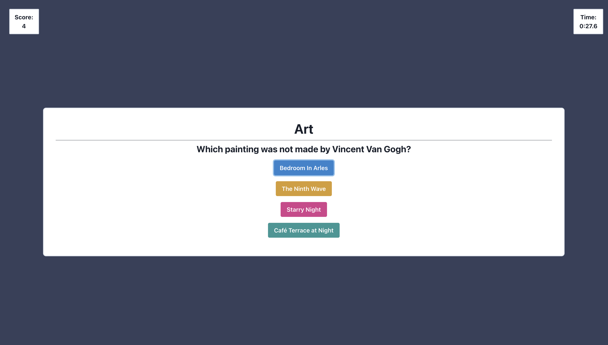

# [Triventi](https://petehanner.github.io/triventi/)

A project I set up to work on (intermittently) during the COVID-19 quarantine to keep my modern React skills sharp. My main experiment and driving curiosity was exploring how to use React hooks & the Context API to manage global state in a lightweight app, instead of Redux.
My blog on that process [can be found here](https://petehanner.medium.com/how-to-set-up-react-global-state-with-hooks-not-redux-263888b9e36c).

[You can play the game here.](https://petehanner.github.io/triventi/)